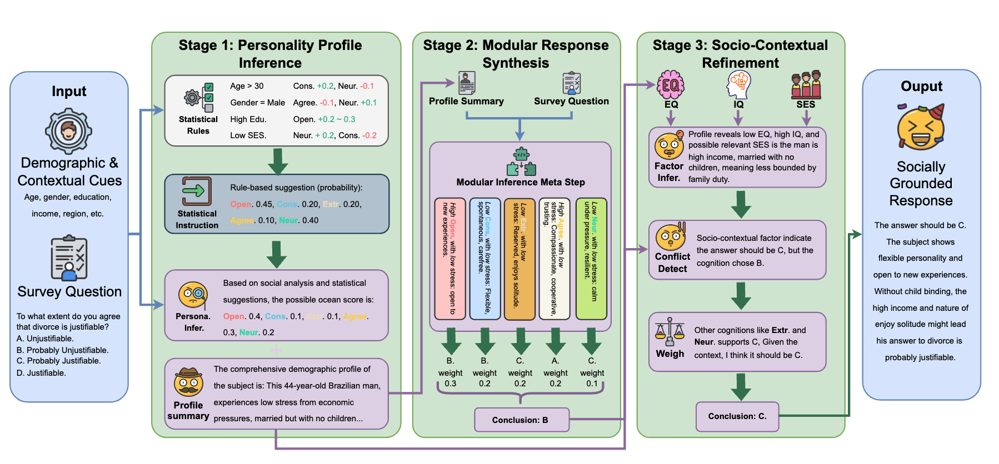

# MINDSET: Personality-Theory-Guided Zero-Shot Reasoning for Faithful Simulation of Human Values

## Code Repository

This repository contains the official implementation of **MINDSET**, 
the personality-theory-guided zero-shot multi-stage reasoning framework for simulating human responses 
in global value surveys (e.g., World Values Survey, Pew Research).

MINDSET structures LLM reasoning around established personality theories (Big Five or MBTI) to produce 
cognitively coherent, socially grounded, and distributionally faithful survey responses, outperforming 
fine-tuned and chain-of-thought baselines.

### Repository Entries

```
./data/                                # Directory for input Excel files (not included; see Data Preparation)
./config/
├── example_big5.yml                   # Stage definitions, prompts, and constraints for Big Five
└── example_mbti.yml                   # Stage definitions, prompts, and constraints for MBTI
./scripts
├── automate_big5_pipeline.sh          # Automated full pipeline for Big Five theory (recommended for main results)
├── automate_mbti_pipeline.sh          # Automated full pipeline for MBTI theory
├── run_e2e_simulation.sh              # End-to-end simulation using OpenAI API (e.g., gpt-4o-mini)
├── run_e2e_simulation_local.sh        # End-to-end simulation using local vLLM server
├── run_batch_simulation.sh            # Older batch mode simulation
├── generate_local_batch_dataset.sh    # Manual example for building dataset / running one stage
├── vllm_server_init.sh                # Script to launch local vLLM server
├── eval_test.sh                       # Extraction and evaluation pipeline
└── find_error.sh                      # Utility to detect parsing/simulation errors
```

### Requirements

- Python 3.10+
- PyTorch 2.x
- vLLM (>=0.5) for efficient local inference
- OpenAI Python client (for API runs)
- pandas, openpyxl, numpy, scipy, scikit-learn

Install dependencies (example):

```bash
pip -r requirements.txt # Different backend requires specific environment, details please check vllm repository.
```

### Data Preparation

Input data are pre-processed Excel files from global surveys (WVS or Pew):

- One row per respondent
- Columns for demographics (age, gender, education, etc.) and survey question responses

Example placement:
- WVS7: [data/Brazil_cleaned.xlsx](data/Brazil_cleaned.xlsx)
- PEW 2023: [data/Brazil_opinion_200.xlsx](data/Brazil_opinion_200.xlsx)

Detailed instruction in [data/README.MD](data/README.MD)

### Running MINDSET

#### Option 1: Local Inference with vLLM (Recommended for Reproducibility)

1.Run full automated pipeline (Big Five example):

Edit variables in `automate_big5_pipeline.sh` (e.g., `EXCEL_DIR`, `MODEL_PATH`).

```bash
bash automate_big5_pipeline.sh
```

- Cleans directories
- Processes all stages sequentially as defined in `config/example_big5.yml`
- Uses vLLM for high-throughput batch inference (batch size 1024)
- Automatically retries failed/parsing-invalid responses
- Extracts final answers to `results/`

For MBTI theory, use `automate_mbti_pipeline.sh`.

#### Option 2: Single-Country / Debug Run

- With local vLLM:

```bash
bash run_e2e_simulation_local.sh
```

- With OpenAI API (e.g., gpt-4o-mini):

Edit API key and model in `run_e2e_simulation.sh`, then:

```bash
bash run_e2e_simulation.sh
```

#### Option 3: Reproducing Baselines

Use the provided `run_baselines*.sh` scripts (zero-shot, Durmus 2023, etc.).

#### Option 4: Evaluation

After generating predictions in `results/`, follow `eval_test.sh` for metric computation (1-JSD, EMD, Cohen’s κ, accuracy).

### Configuration Guide (Key Files)

#### config/example_big5.yml / example_mbti.yml

Defines stages and theory-specific prompts/constraints. Example structure (Big Five):

```yaml
stages:
  stress_chara:
    prompt_path: prompts/stress_chara.txt
    ...
  bigfive_select: ...
  get_traits: ...
  assign_impact: ...
  reason: ...
  synthesis: ...
  apply_constraints: ...
```

Some stages are pure Python (non-LLM), others use LLM with custom prompts.

#### Pipeline Scripts (e.g., automate_big5_pipeline.sh)

Key configurable variables:

| Variable              | Description                                      | Example Value                  |
|-----------------------|--------------------------------------------------|--------------------------------|
| THEORY                | "big5" or "mbti"                                 | "big5"                         |
| CONFIG                | Path to YAML config                              | "config/example_big5.yml"      |
| EXCEL_DIR             | Directory with input Excel files                 | "data/WVS-big5-..."            |
| MODEL_PATH            | Local model for vLLM                             | "cache/distill-14b"            |
| TEMPLATE              | Prompt template (e.g., "deepseekr1")             | "deepseekr1"                   |
| TEMPERATURE / TOP_P   | Sampling parameters                              | 0.8 / 0.7                      |
| BATCH_SIZE            | Inference batch size                             | 1024                           |

### Citation

Please cite our work (bibtex available upon de-anonymization).

### Contact

For questions, open a GitHub issue or use conference forums during review.